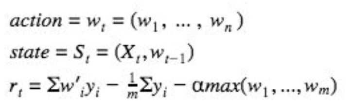
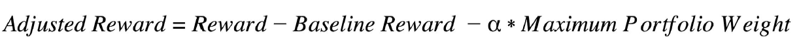
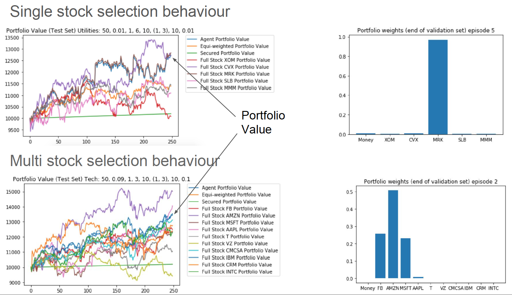
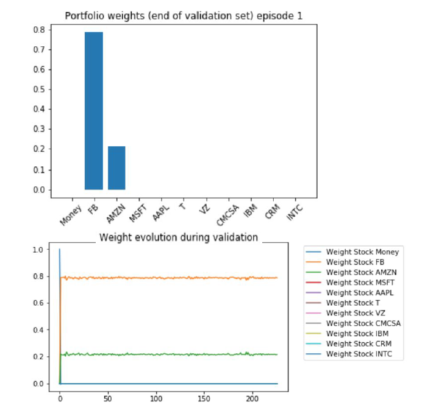

# A Deep Reinforcement Learning Framework for the Financial Portfolio Management Problem

This repository presents our work during a project realized in the context of the [IEOR 8100 Reinforcement Leanrning](https://github.com/ieor8100/rl) at Columbia University.

This Deep Policy Network Reinforcement Learning project is our implementation and further research of the original paper [A Deep Reinforcement Learning Framework for the
Financial Portfolio Management Problem (Jiang et al. 2017)](https://arxiv.org/abs/1706.10059). 

<b>Objective:</b> The problem is the one of automated portfolio management: given a set of stocks, how to best allocate money through time to
maximize returns at the end of a certain number of timesteps. In this way, we aim to build an automated agent which best allocates the weights of its investment between different stocks.

<b>Data:</b> Jiang et al. use 13 crypto-currencies from the Poloniex exchange. They take into account the open, high, low, close (OHLC) prices,
minute per minute. They allow a portfolio rebalance every 30 minutes. They reprocess the data and create a tensor based on the last
50 time-steps.  

We extend the experiment to the stock market, using the framework on daily data and intraday data with a daily rebalance. 

The project is decomposed in 3 parts:
- Data Preprocessing 
- Environment Set-up
- Deep policy network design 
- Training and Testing of the agent

The files are: 
- data_pipe.ipynb: pre-processing of S&P500 data
- data_pipe_poloniex.ipynb: pre-processing of Poloniex data
- environment.py: trading environment render
- DPM.ipynb: main notebook 
- individual_stocks_5yr: folder with the raw [S&P500 data](https://www.kaggle.com/camnugent/sandp500)
- np_data: folder with the processed input data/used by the DPM notebook 
- poloniex_data: poloniex crypto-currencies data
- Poster.pdf: poster shown during final evaluation session

## Data Preprocessing

For each stock, the input is a raw time series of the prices (High, Low, Open, Close). 
The output is a matrix of 4 rows (3 in the case of the cryptocurrencies - Open(t) = Close(t-1) - the market never closes) and n (number of available data points) columns.  
The columns correspond to:
- Close(t-1)/Open(t-1)
- High(t-1)/Open(t-1)
- Low(t-1)/Open(t-1)
- Open(t)/Open(t-1)

## Deep Policy Network Design 

### RL Framework

The portfolio manager agent is set-up in the way:
- The <b>state</b> (at time t) is the input matrix and the previous portfolio weights (at time t-1). 
- The <b>action</b> is the vector of investment weight (at time t).
- The <b>reward function</b> is defined such as it is the agent's return minus a baseline’s return (baseline is an equi weighted agent - invest in all the possible stocks in the same way) minus a term proportional to the maximum of the weight (this term is set-up to make the agent avoids to invest fully in one stock)

### Deep Policy Function Architecture

The policy function is designed through a deep neural network which takes as input the input tensor (shape m x 50 x (3 or 4)) composed of :
- the m traded stocks 
- the 3/4 matrix columns (processed OHLC)
- 5O previous time steps

A first convolution is realized resulting in a smaller tensor. Then, a second convolution is made resulting in 20 vector of shape (m x 1 x 1). The previous output vector is stacked. 
The last layer is a terminate convolution resulting in a unique m vector. 
Then, a cash bias is added and a softmax applied. 

The output of the neural network is the vector of the actions the agent will take. 

Then, the environment can compute the new vector of weights, the new portfolio and instant reward.

## Training and Testing of the agent

This part is still in progress as of today. Our thought is we are still not able to reproduce the paper's results. 
Indeed, even if the algorithm demonstrated the capacity to identify high-potential stocks which maximizes results. However, it has a little potential to change the position through the trading process. 

## Understanding the problem & possible improvement

We tried many initial parameters such as low trading cost to produce incentive to change of position. 

The agent is 'training sensitive' but it is not 'input state sensitive'. 

In order to make the policy more dynamic, we think of using a discrete action space using pre-defined return thresholds. We'll turn the problem replacing the softmax by a tanh or by turning it into a classification task. 

## Author

* **Selim Amrouni** [selimamrouni](https://github.com/selimamrouni)
* **Aymeric Moulin** 
* **Philippe Mizrahi** [pcamizrahi](https://github.com/pcamizrahi)

